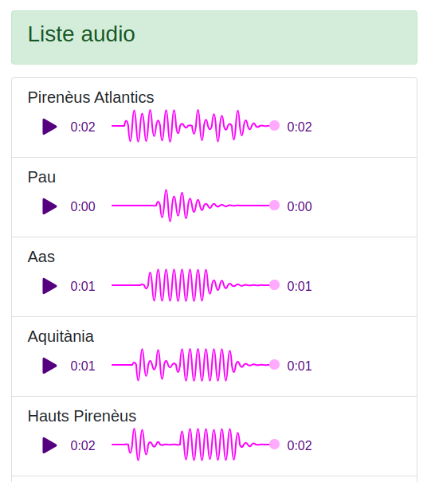
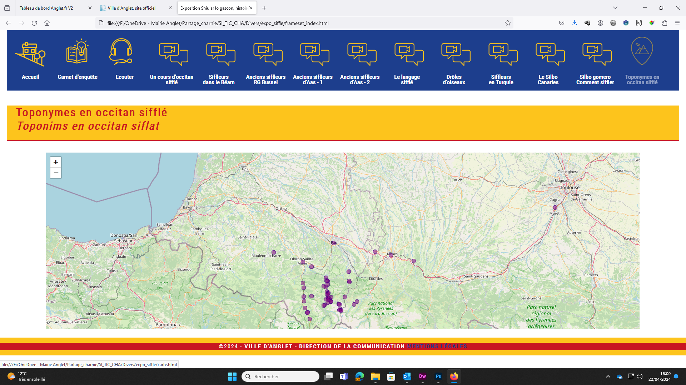
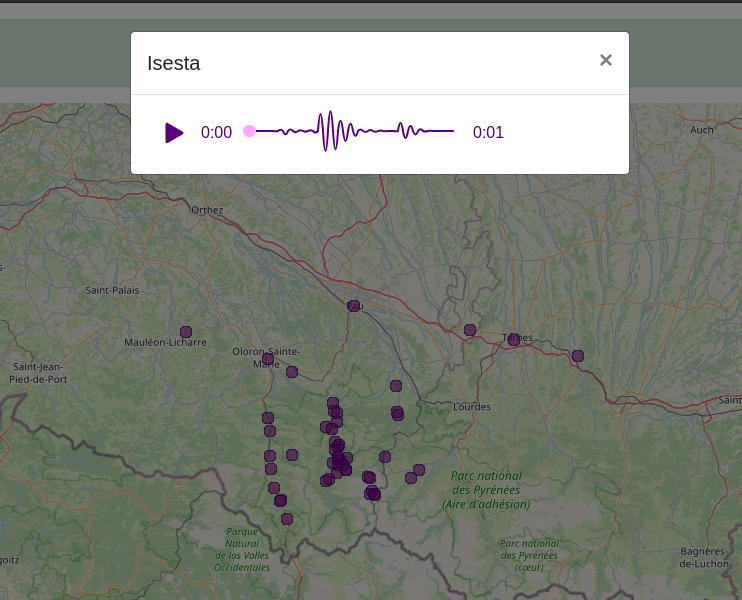
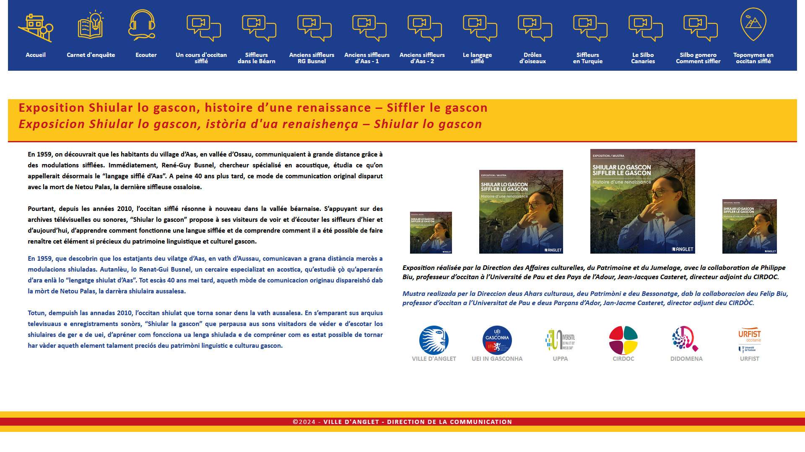
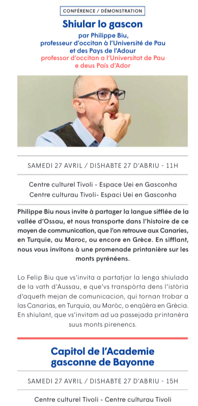

# NamesOfTheLand

**NamesOfTheLand** uses citizen-created maps to put regional and endangered languages back upon their territories. We therefore showcast the traditional names of the land, questioning the visitor and the comunity on their current naming usage of their territories. 

## Background
This project has been initiated by Gascon, a subgroup of the Occitan people. A lively language family with about 15 millions speakers around 1900, this practice was mostly disapeared following sustained monolingualist French policies. Today, rare elders and few younger people support its conservation and modest revitalisation. We want to remember, hear, pronunce the native names of our villages, our mountains, our plains, rivers and modest lakes. We wish to share these calls, voices, whistles with our gone grand parents. We these ancient sounds waves of our land, we connect back with generations and generations of our ancestors living accross these landscapes they knew and cared for for centuries.

## Structure 
```
├── index.html : interactive multimedia map
├── list.html : interactive multimedia list
├── about.html : about and credit page
├── img/ : images used by the webpages
├── doc/ : documentations and copyrighted images from media coverages
├── css/ : styles (not used yet)
└── js/ : behaviors (no used yet)
```

## Visuals
  

## Authors
- Hugo Lopez, URFIST Occitanie, Université de Toulouse (UT) : project management, training, SPARQL, conception, coding.
- Delphine Montagne, Université de Pau et des Pays de l'Adour (UPPA) : data alignement, communication.
- Philippe Biu, professor of Occitan whistled : recordings, exhibition.
See also [./about.html](https://hugolpz.github.io/NamesOfTheLand/about.html)

## See also
- [Lingualibre.org](https://lingualibre.org)

## Media
- [Siffler le gascon, histoire d’une renaissance](https://www.anglet.fr/sorties/agendas/detail-dun-agenda/actualites/siffler-le-gascon-histoire-dune-renaissance/)
- [Shiular lo gascon](https://www.calameo.com/villeanglet/read/0002051056b581caa133c)
- [Wikimedia Commons Occitan Whistle](https://commons.wikimedia.org/wiki/Category:Lingua_Libre_pronunciation-other_(Q117707514))

  

## Replication
### Requirements
Skills :
- Wikidata / SPARQL (basic)
- Lingualibre recording
- Github (basic)
- Text editing

Variables :
- ISO of your labels language (ex: `oc`)
- Wikidata Qid of your language (ex: `Occitan whistled from Aas (Q117707514)`)
- Wikidata Qid of your target administrative area (ex: `Pyrénées-Atlantiques (Q12703)`)
- Wikimedia Commons prefix for your language (ex: `LL-Q117707514`)

### Recording toponyms
1. Open [Wikidata Query service](https://query.wikidata.org/), input the following SPARQL, change language and administrative area's Qids.
```sparql
# SPARQL QUERY HERE
#Cats
SELECT ?id ?idLabel (?idLabel as ?label)
WHERE {
  ?id wdt:P31 wd:Q146. # Must be a cat
  SERVICE wikibase:label { bd:serviceParam wikibase:language "[AUTO_LANGUAGE],en". } # Helps get the label in your language, if not, then en language
}
```
2. Run query : results appears > Click "Link" > Right-click on "SPARQL endpoint" : copy link address
3. Open [Lingualibre studio](https://lingualibre.org/wiki/Special:RecordWizard) > Step 3 : click "External tools" > paste the link adress.
4. Record these labels, publish them to Wikimedia Commons.

Within a week or two, these toponyms recordings will be added to their Wikidata concepts.

### Hack the map
1. Open `index.html`
  1. Replace `oc` and `ocw` by your ISO
  2. Replace `Q117707514` by your language Wikidata Qid

## Licences
- MIT Licence for code
- CC-BY-SA-4.0 for contents
- `/doc/*` contains copyrighted materials
